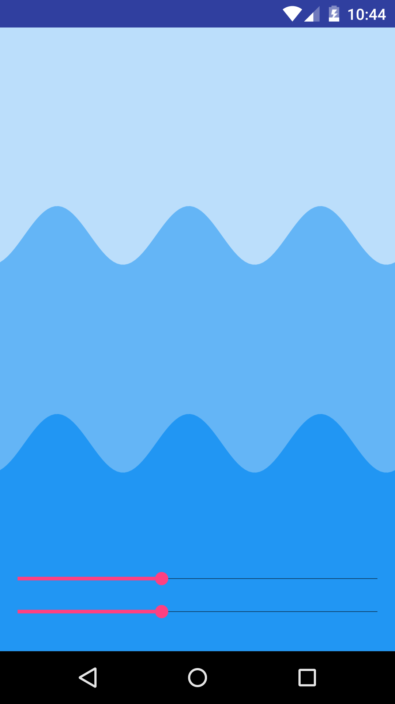

# WaveView - Android custom view.

[](http://www.apache.org/licenses/LICENSE-2.0.html)
[](https://github.com/developer-shivam/WaveView.git)

### Min SDK 9 (Android 2.3–2.3.1 Gingerbread)

### Preview
  

### About
This custom view is sturctured of Sine Wave Equation.

The sine wave formula is : 
y(t) = A sin(2πft + ρ) = A sin(ωt + ρ)

The above formula can be explained in sound terms as follows:

y = amplitude X sin ( 2π ( velocity of rotation in cycles per second))

Increasing the amplitude of the sine wave, how high the tops and bottoms of the wave go, increases the volume.  Increasing or decreasing the cycle rate, how many cycles over distance/time, increases and decreases the pitch of the sound – how high or low the tone sounds.

### Implementation (XML)

```xml
	<developer.shivam.library.WaveView
        android:id="@+id/sample_wave_view"
        android:layout_width="match_parent"
        android:layout_height="wrap_content"
        wave:wave_speed="1"
        wave:wave_height="2"/>
```
### Implementation (Java)
``` java
WaveView view = new WaveView(this);
        view.setSpeed(5);
        view.setAmplitude(5);
        setContentView(view);
```

To use this awesome library you first need to add below lines to build.gradle at your project root level

```xml
allprojects {
		repositories {
			...
			maven { url "https://jitpack.io" }
		}
	}
```

And then add dependency to your app build.gradle file
```xml
dependencies {
	        compile 'com.github.developer-shivam:WaveView:1.0'
	}
```

And you're done! Don't forget to give a star.

#### Features 
- Two attribute to control wave behaviour.
- One for controlling the amplitude of wave (Height of wave).
- Second to control speed of wave (Movement along x-axis).

#### What else to come 
- Wave height controlled with sound input
- Different color palettes
